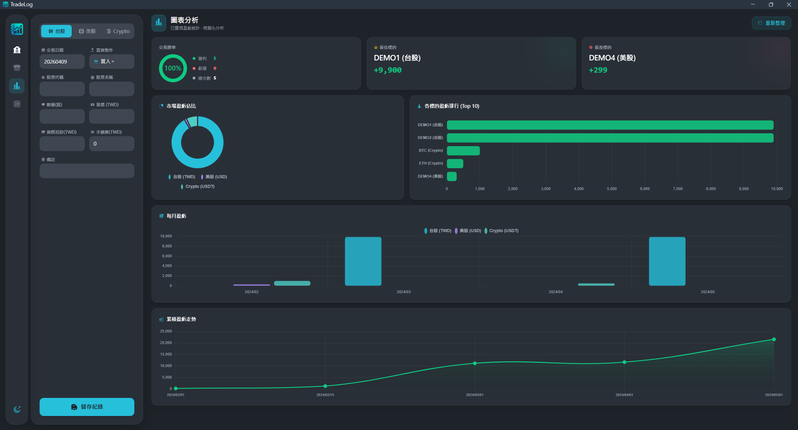
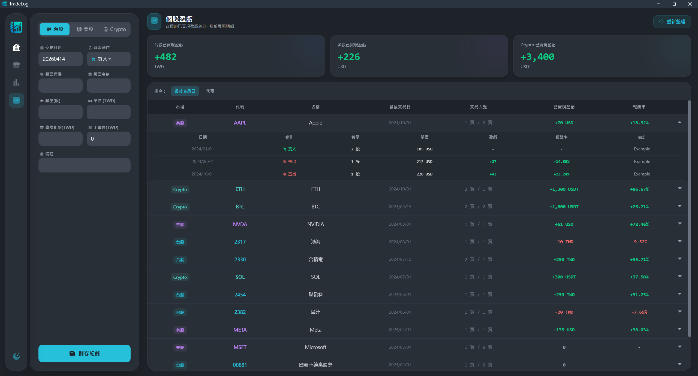
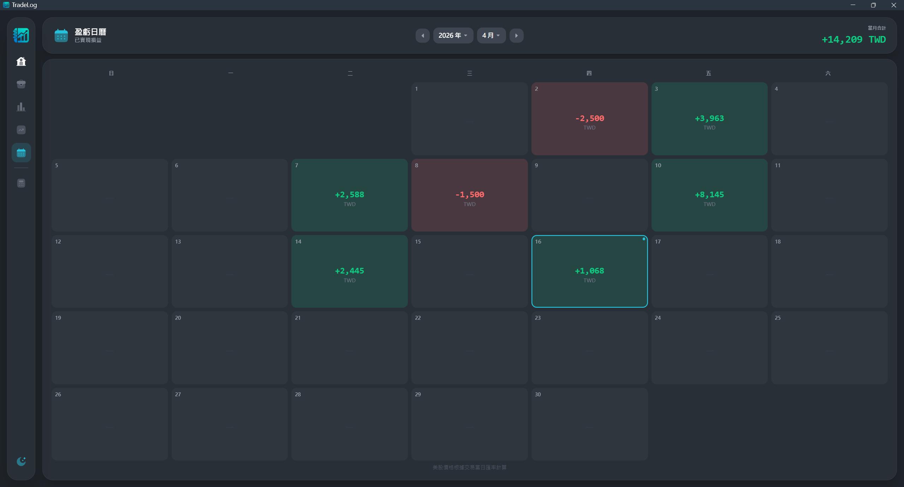
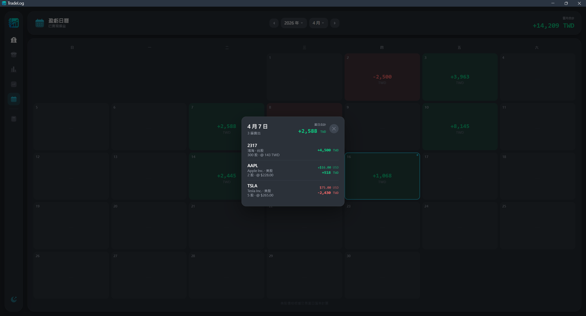
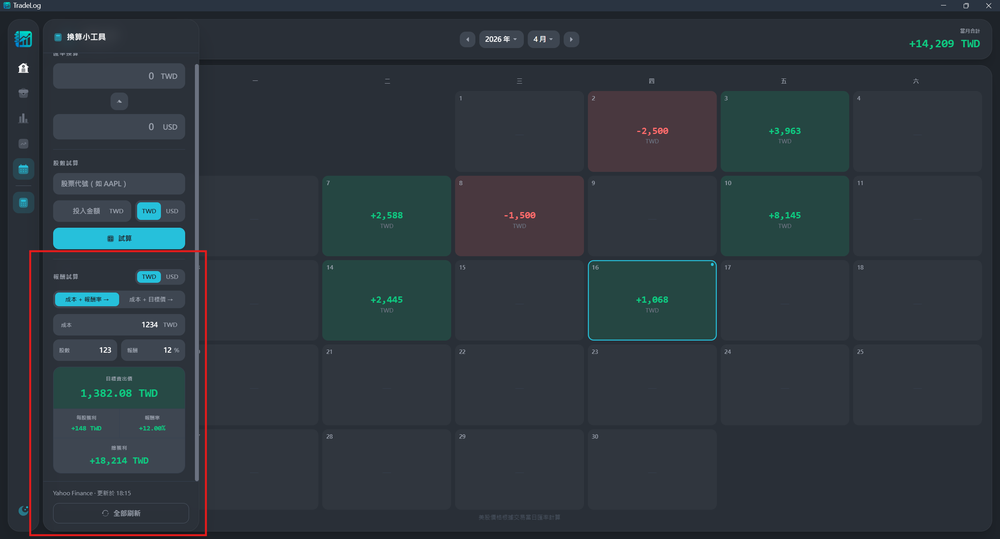

# TradeLog

> 個人投資交易記帳工具，支援台股、美股、加密貨幣三大市場


---

## 功能特色

- **Dashboard** — 台股、美股、Crypto 已實現盈虧即時統計，含分頁與即時搜尋
- **持倉總覽** — 移動平均法自動計算持倉均價、總成本與未實現盈虧
- **圖表分析** — 勝率統計、每月盈虧長條圖、累積盈虧走勢、各市場交易次數
- **個股盈虧** — 各標的已實現盈虧與報酬率統計，支援排序與點擊展開交易明細
- **即時股價** — 自動透過 Yahoo Finance 抓取台股（含上市/上櫃）、美股即時股價，計算未實現盈虧與匯率換算
- **換算小工具** — 側邊快捷面板，支援 TWD/USD 即時雙向匯率換算、輸入股票代號與投入金額試算可買股數，以及報酬率試算（正向／反向，支援多股數計算總獲利）
- **盈虧日曆** — 月曆視圖顯示每日已實現盈虧，點擊有交易的日期可展開當日明細，支援台股與美股（含歷史匯率換算）
- **搜尋/篩選** — 依代碼、名稱、備註即時搜尋，支援日期範圍篩選
- **匯出 CSV** — 匯出時可選擇儲存位置，Excel 可直接開啟


---

## 核心技術

### 移動平均法對帳系統
每次賣出時，系統自動依歷史買入紀錄計算當前持倉均價，精確計算已實現盈虧，並具備庫存不足防錯機制。

### 架構設計
```
web/
├── index.html          # 主框架
├── lib/                # 前端套件（本地化，離線可用）
├── js/
│   ├── api.js          # 後端 API 統一管理
│   ├── ui.js           # 共用 UI 工具函數（主題、即時股價共用狀態）
│   ├── dashboard.js    # 主頁邏輯
│   ├── holdings.js     # 持倉總覽邏輯
│   ├── charts.js       # 圖表分析邏輯
│   ├── stockprofit.js  # 個股盈虧邏輯
│   ├── calculator.js   # 換算小工具邏輯
│   └── calendar.js     # 盈虧日曆邏輯
```

---

## 技術棧

| 類別 | 技術 |
|------|------|
| 後端 | Python 3.10+、Eel、SQLite |
| 前端 | HTML、TailwindCSS、JavaScript |
| 圖表 | Chart.js |
| 動畫 | GSAP |
| 日期選擇 | Flatpickr |

---

## 快速開始

### 方式一：直接下載（推薦）
前往 [Releases](https://github.com/s1095450/TradeLog/releases) 下載最新版 `TradeLog.exe`，雙擊執行即可。

> 需要安裝 Microsoft Edge 瀏覽器

### 方式二：從原始碼執行
**1. 安裝依賴**
```bash
pip install eel yfinance
```

**2. 啟動程式**
```bash
python main.py
```

> 需要安裝 Microsoft Edge 瀏覽器

---

## 截圖
**v1.4.0**

**Dashboard**


**持倉總覽**


**圖表分析**


**個股盈虧**


**盈虧日曆**



**換算小工具**


**報酬試算**



---

## License

MIT